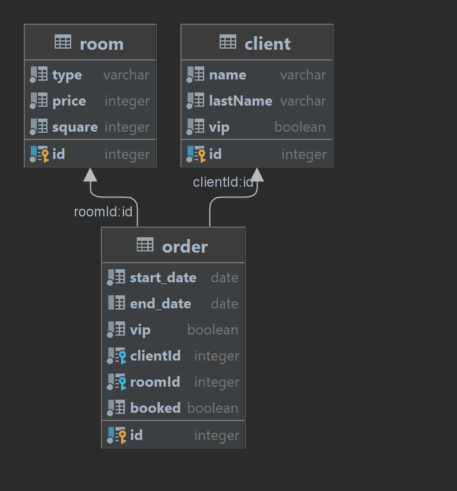

# Hotel API

Реализован API веб сервиса “Бронирование номера в отеле”

### Стек:

NestJS, Postgres, TypeORM, Docker, Swagger 3.0

## Инструкция по запуску

```bash
# 1. Скачать или склонировать репозиторий.

# 2. Развернуть базу данных в контейнере 
docker-compose up -d --build db

# 3. Загрузить тестовые данные в БД
pg_restore --host "localhost" --port "5432" --username "user" 
--no-password --dbname "hotel" --verbose "test.sql"

# 4. Собрать и запустить API в контейнере
docker-compose up -d --build api
```

## Структура базы данных



## Основные маршруты:

- GET /room — возвращает все номера в отеле
- POST /order/available — получить список свободных номеров
  в отеле на определенный период времени
- POST /order — забронировать номер в отеле на определенный срок
- POST /order/cancel — отменить бронь номера в отеле

## Добавленные наработки:

- При бронировании осуществляется проверка дат, клиента и наличия комнат в отеле
- Добавлена глобальная валидация данных
- При ошибки валидации показывает причину.


